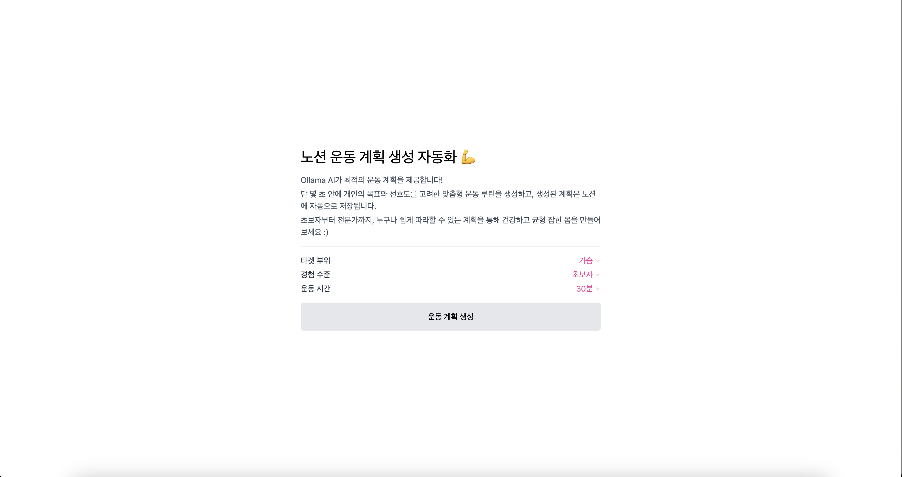

# 💪 노션 운동 계획 생성 자동화 플랫폼



## 📋 프로젝트 소개

**노션 운동 계획 생성 자동화** 프로젝트는 **Ollama AI**를 사용하여 사용자의 운동 목표와 선호도를 고려한 **맞춤형 운동 계획을 생성**하고, 그 계획을 **노션에 자동으로 저장**해주는 편리한 솔루션입니다. 이 프로젝트를 통해 **운동 계획을 세우는 부담**을 덜고, **개인화된 루틴을 쉽게 관리**할 수 있습니다.

## ✨ 주요 기능

- 🤖 **AI 기반 운동 계획 생성**: Ollama AI가 사용자의 목표와 경험 수준을 분석하여 개인화된 운동 루틴을 제공합니다.
- 📊 **노션 자동 기록**: 생성된 운동 계획은 **노션 페이지**에 자동으로 기록되어 언제든지 쉽게 조회하고 수정할 수 있습니다.
- ⏱️ **빠르고 간편한 사용**: 단 몇 초 안에 운동 루틴을 생성하고 저장할 수 있어 **사용자의 시간을 절약**합니다.

## 🚀 기술 스택

- **Frontend**: React, Tailwind CSS
- **Backend**: Express.js, Axios, OpenAI API (Ollama)
- **Database Integration**: Notion API

## 📦 설치 방법

### 1. 클론 리포지토리

```bash
git clone https://github.com/hyunwestpark/notion-integration-platform.git
cd notion-integration-platform
```

### 2. 프로젝트 디렉토리로 이동:

```bash
cd notion-integration-platform
```

### 3. 프론트엔드 종속성 설치:

```bash
cd frontend
npm install
```

### 4. 백엔드 종속성 설치:

```bash
cd ../backend
npm install
```

### 5. 환경 변수 설정:

- `backend` 폴더 안에 `.env` 파일을 생성하고 다음 내용을 추가하세요:

```
NOTION_API_KEY=your_notion_api_key_here
PAGE_ID=your_page_or_database_id_here
```

### 6. 백엔드 서버 실행:

```bash
cd backend
node server.js
```

### 7. 프론트엔드 서버 실행:

```bash
cd ../frontend
npm run dev
```

## 🏃 실행 방법

1. **애플리케이션을 브라우저에서 열기** (`http://localhost:5173`).
2. **운동 목표나 계획**을 입력하고 제공된 버튼을 클릭하여 **"운동 계획 생성"**을 누릅니다.
3. **노션 페이지**에서 자동으로 생성된 운동 계획을 확인하세요.
